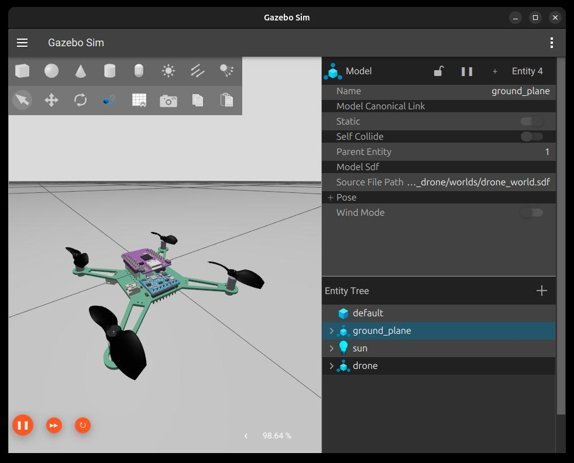

# sim_drone

Ambiente de simulación en Gazebo y ROS 2 de dron (Sin autopiloto).



## Requisitos

- Una instalación de ROS 2 Jazzy.
- `colcon` y las dependencias declaradas por los paquetes.
- La herramienta de simulación que requiera el proyecto (por ejemplo, Gazebo), si aplica.

## Compilar

Instala las dependencias requeridas y compila:

```bash
cd {ros workspace}
rosdep install --from-paths src --ignore-src -r -y
colcon build --symlink-install
source install/setup.bash
```

Vuelve a ejecutar `source install/setup.bash` en cada terminal nueva donde quieras usar los paquetes del workspace.

## Ejecutar la simulación

Para lanzar la simulación del dron en Gazebo, ejecuta el siguiente comando:

```bash
ros2 launch sim_drone sim_gazebo.launch.py
```

Este launch file inicia:

- El servidor de Gazebo con el mundo personalizado (`drone_world.sdf`)
- La interfaz gráfica de Gazebo
- El robot state publisher para cargar la descripción del robot
- El bridge ROS-Gazebo para la comunicación entre ROS 2 y Gazebo
- El spawn del modelo del dron en la simulación

El mundo incluye el plugin de IMU y de barometer, y está configurado para proporcionar una plataforma de simulación realista para el dron.

En el se pueden llevar a cabo pruebas de control, así como la integración de sensores y algoritmos de navegación.
